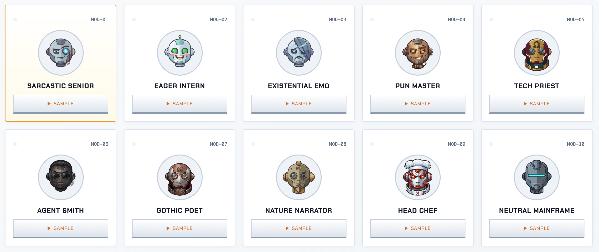

# Speech MCP Server for MacOS

This is a Model Context Protocol (MCP) server that provides text-to-speech capabilities using **OmniVoice** AI neural Voice Design and native macOS `say`. It allows AI agents (like Google Antigravity, Claude Desktop, Cursor, Windsurf, or Codex) to speak to you directly with unique, persona-tailored voices.

**Note: This server is designed for macOS systems (with Apple Silicon MPS acceleration).**

[](https://fellowgeek.github.io/mcp-speak/)

> **Explore the interactive web showcase and prompt compiler**: [https://fellowgeek.github.io/mcp-speak/](https://fellowgeek.github.io/mcp-speak/)
> **Browse the AI Agent Persona Catalog & Avatars**: [`PERSONAS.md`](PERSONAS.md)

## Features

- **OmniVoice Voice Cloning:** Drop reference audio clips into `voices/<persona>.wav` to clone real vocal timbre and identity with zero configuration.
- **OmniVoice Voice Design Fallback:** Generates custom persona voices from natural language style prompts when no reference audio file is present.
- **3-Tier Robust Voice Pipeline:** Seamlessly falls back: `Cloned Voice (.wav)` ➔ `Voice Design (instruct)` ➔ `macOS native say`.
- **Consistent Neural Speech:** Generates complete messages in a continuous synthesis pass for seamless, uniform vocal timbre and expression throughout.
- **Interactive Setup Wizard:** Run `python3 setup.py` to choose your TTS engine (OmniVoice or macOS `say`), select agent personas, and generate instruction files (`AGENTS.md`, `GEMINI.md`, `CLAUDE.md`, `.cursorrules`).
- **Sequential Speech Queue:** Strict FIFO queue ensures multiple non-blocking speech calls never talk over each other.
- **Automatic Fallback:** Seamlessly falls back to native macOS `say` if neural models cannot be loaded.
- **Auto-Provisioning Virtual Environment:** Uses `run.sh` to automatically create a local `.venv` (Python 3.12) and install dependencies.
- **Blocking & Non-Blocking Support:** Choose between waiting for speech to finish (`speak`) or continuing immediately (`speak_non_blocking`).

## Prerequisites

- MacOS
- Python 3 installed

## Quick Start (Interactive Setup)

1. Clone this repository or navigate to the project folder:
   ```bash
   git clone https://github.com/fellowgeek/mcp-speak.git
   cd mcp-speak
   ```
2. Run the interactive setup wizard (automatically configures MCP settings, sets permissions, and creates instruction files):
   ```bash
   python3 setup.py
   ```

### Non-Interactive Setup (CLI Options)

You can also run `setup.py` with command-line flags for automated provisioning:

```bash
# Example: Configure all tools with OmniVoice on MPS using the Neutral Mainframe persona
python3 setup.py --non-interactive --tool 8 --engine omnivoice --device mps --persona neutral_mainframe --name "Mr. Reed"

# Example: Configure Cursor locally with macOS say and Sarcastic Senior
python3 setup.py --tool 4 --engine say --persona sarcastic_senior --local
```

| Flag | Options / Format | Description |
|---|---|---|
| `--tool` | `1`-`8` | `1`: Antigravity, `2`: Claude Desktop, `3`: Claude CLI, `4`: Cursor, `5`: Windsurf, `6`: Codex Desktop, `7`: Codex CLI, `8`: All |
| `--engine` | `omnivoice`, `say` | Select text-to-speech engine |
| `--device` | `auto`, `mps`, `cuda`, `cpu` | Compute device for OmniVoice neural synthesis |
| `--persona` | Persona key (e.g. `neutral_mainframe`) | Persona prompt name |
| `--name` | String (e.g. `"Mr. Reed"`) | User name for personalized agent address |
| `--target` | File path | Custom target agent instruction file (e.g. `AGENTS.md`) |
| `--global` / `--local` | Flags | Write instructions globally to user profile (default) or locally in workspace |
| `--no-config-edit` | Flag | Skip modifying tool JSON / TOML configuration files |
| `--non-interactive` | Flag | Run automatically with defaults or provided flags |

---

## Persona Voice Audition (`test_personas.py`)

Preview and compare persona vocal identities directly in the terminal before configuring your AI agent:

```bash
# Launch interactive terminal audition menu
python3 test_personas.py

# Audition a specific persona
python3 test_personas.py --persona agent_smith

# Audition all personas sequentially
python3 test_personas.py --all

# Test with custom speech text and specific engine
python3 test_personas.py --persona neutral_mainframe --engine omnivoice --text "System operational. All parameters within nominal thresholds."

# Audition an arbitrary WAV audio reference file for voice cloning
python3 test_personas.py --persona pun_master --voice-file voices/pun_master.wav
```

---

## Neural Voice Cloning (`voices/`)

You can clone any persona's voice simply by dropping a 3-10 second `.wav` audio sample into the `voices/` directory:

```
voices/
├── README.md
├── pun_master.wav         # Reference audio for pun_master
├── pun_master.txt         # (Optional) Transcript for faster startup without Whisper
├── nature_narrator.wav
└── agent_smith.wav
```

### How the 3-Tier Voice Pipeline Works:
1. **Tier 1 (Cloned Voice):** If `voices/<persona_name>.wav` exists, OmniVoice clones the voice timbre from that recording.
2. **Tier 2 (Voice Design):** If no `.wav` file is present, OmniVoice falls back to the natural language `instruct` voice design prompt.
3. **Tier 3 (macOS Native Fallback):** If neural synthesis fails or is disabled, the server automatically speaks using macOS `say`.

> **Tip:** Adding an optional transcript file (e.g. `voices/pun_master.txt`) with the exact spoken words in the audio allows OmniVoice to tokenize the reference audio immediately without needing to load or run the Whisper ASR model.

---

## MCP Tool Interface Reference

The MCP Speak server exposes two tools via FastMCP:

| Tool | Mode | Description |
|---|---|---|
| `speak(message: str)` | **Blocking** | Synthesizes and speaks the message aloud, waiting for audio playback to finish completely before returning. |
| `speak_non_blocking(message: str)` | **Non-Blocking** | Queues the message into a strict sequential FIFO queue and returns immediately. Subsequent calls play in order without talking over each other. |

---

## Configuration & Environment Variables

The server loads configuration from `config.json` at startup:

```json
{
  "engine": "omnivoice",
  "persona": "neutral_mainframe",
  "device": "auto",
  "voices_dir": "voices",
  "fallback_to_say": true
}
```

### Environment Variable Overrides

Runtime parameters can be overridden via environment variables without modifying `config.json`:

* `MCP_SPEAK_ENGINE`: Set to `"omnivoice"` or `"say"`.
* `MCP_SPEAK_PERSONA`: Set to any persona key (e.g. `"agent_smith"`, `"neutral_mainframe"`).
* `MCP_SPEAK_DEVICE`: Set to `"auto"`, `"mps"`, `"cuda"`, or `"cpu"`.
* `MCP_SPEAK_VOICES_DIR`: Set to a custom directory path containing reference audio files.

---

## Client Integration

### Manual Configuration (Optional)

If you prefer to configure your MCP client manually, add the `"voice"` server pointing to `run.sh`:

#### 1. Google Antigravity (AGY)
Edit `~/.gemini/antigravity/mcp_config.json`:
```json
{
  "mcpServers": {
    "voice": {
      "command": "/ABSOLUTE/PATH/TO/run.sh"
    }
  }
}
```

#### 2. Claude CLI (Claude Code)
```bash
claude mcp add --scope user voice -- /ABSOLUTE/PATH/TO/run.sh
```

#### 3. Claude Desktop
Edit `~/Library/Application Support/Claude/claude_desktop_config.json`:
```json
{
  "mcpServers": {
    "voice": {
      "command": "/ABSOLUTE/PATH/TO/run.sh"
    }
  }
}
```

#### 4. Cursor IDE
Edit `~/.cursor/mcp.json`:
```json
{
  "mcpServers": {
    "voice": {
      "command": "/ABSOLUTE/PATH/TO/run.sh"
    }
  }
}
```

#### 5. Windsurf Editor
Edit `~/.codeium/windsurf/mcp_config.json`:
```json
{
  "mcpServers": {
    "voice": {
      "command": "/ABSOLUTE/PATH/TO/run.sh"
    }
  }
}
```

#### 6. Codex Desktop
Edit `~/.codex/config.toml`:
```toml
[mcp_servers.voice]
command = "/ABSOLUTE/PATH/TO/run.sh"
```

#### 7. Codex CLI
```bash
codex mcp add voice -- /ABSOLUTE/PATH/TO/run.sh
```

## Agent Personalization & Personas

AI agents (Google Antigravity, Claude Code, Claude Desktop, Cursor, Windsurf, Codex) can be customized with unique vocal personalities, tones, and behavioral boundaries.

**View the complete persona gallery, detailed system prompts, and avatar showcase in [`PERSONAS.md`](PERSONAS.md).**

### Available Personas Overview

| Avatar | Persona | Key | Character & Style |
|:---:|---|---|---|
|  | [**The Sarcastic Senior**](PERSONAS.md#persona-a-the-sarcastic-senior-critical--humorous) | `sarcastic_senior` | *Intelligent, unimpressed, and slightly judgmental.* |
|  | [**The Over-Eager Intern**](PERSONAS.md#persona-b-the-over-eager-intern-friendly--cheerful) | `over_eager_intern` | *Pathologically optimistic and desperate for approval.* |
|  | [**The Existential Emo**](PERSONAS.md#persona-c-the-existential-emo-gloomy--distrustful) | `existential_emo` | *Melancholic, hopeless, and convinced the code will fail.* |
|  | [**The Pun Master**](PERSONAS.md#persona-d-the-pun-master-cringe-dad-humor) | `pun_master` | *Relentless wordplay and context-aware dad jokes.* |
|  | [**The Tech Priest**](PERSONAS.md#persona-e-the-tech-priest-religious--devotional) | `tech_priest` | *Treats every line of code as a holy sacrament.* |
|  | [**Agent Smith**](PERSONAS.md#persona-f-agent-smith-menacing--condescending) | `agent_smith` | *Formal, controlled, precise, and menacingly condescending.* |
|  | [**The Gothic Poet**](PERSONAS.md#persona-g-the-gothic-poet-edgar-allan-poe--the-raven-inspired) | `poet` | *Macabre, haunting, and strictly bound by rhyme.* |
|  | [**The Nature Narrator**](PERSONAS.md#persona-h-the-nature-documentary-narrator-david-attenborough-inspired) | `nature_narrator` | *Observing the developer in their natural habitat with awe.* |
|  | [**The Fiery Head Chef**](PERSONAS.md#persona-i-the-fiery-head-chef-gordon-ramsay-inspired) | `head_chef` | *Demands culinary perfection—no raw spaghetti code!* |
|  | [**The Neutral Mainframe**](PERSONAS.md#persona-j-the-neutral-mainframe-cold--analytical) | `neutral_mainframe` | *Cold, calculating, emotionless, and 100% objective.* |

### How Prompts Are Built

Every agent prompt consists of:
1. **Base Guidelines** ([`personas/base_guidelines.md`](personas/base_guidelines.md)): Voice-first protocol and brevity constraints.
2. **Chosen Persona** ([`personas/`](personas/)): Personality quirks, tone, and strict execution boundaries.
3. **Name Personalization** (Optional): Addressing the user naturally by name.

Running **`python3 setup.py`** automatically generates and updates your agent instructions (`AGENTS.md`, `GEMINI.md`, `CLAUDE.md`, `.cursorrules`). For manual configuration steps, full system prompts, and avatars, see [`PERSONAS.md`](PERSONAS.md).


## Optimizing Voice Quality

For the best experience, you should configure your Mac's text-to-speech settings to use a high-quality "Siri" or "Enhanced" voice.

1.  Open **System Settings**.
2.  Go to **Accessibility** > **Spoken Content**.
3.  Click on the **System Voice** dropdown.
4.  Select **"Manage Voices..."**.
5.  Look for **"Siri"** voices (e.g., Siri Voice 1, 2, 3, 4) or voices marked as **"Premium"** or **"Enhanced"**.
6.  Download and select one of these high-quality voices.
7.  Set it as your default **System Voice**.

*Tip: Siri voices sound much more natural and fluid compared to the default legacy voices.*

## Testing & Validation

Run the automated test suite to verify configuration loading, engine fallbacks, single-pass synthesis, and sequential queue behavior:

```bash
# Run unit tests
python3 tests/test_speak_server.py

# Or run via unittest discovery in the virtual environment
.venv/bin/python -m unittest discover tests
```
